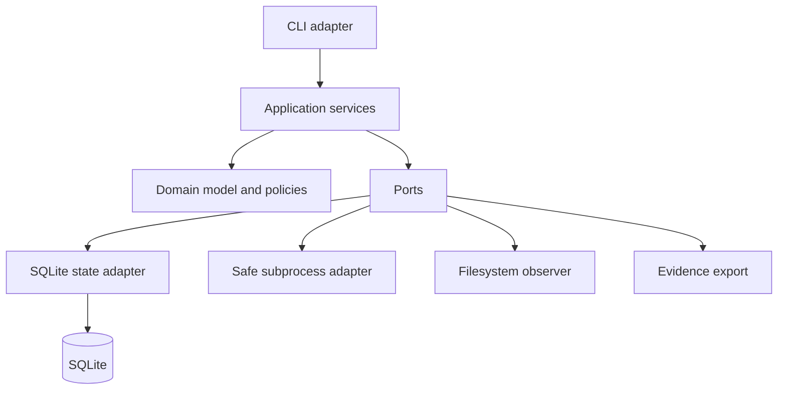

# RunWeave

**Safe, resumable runbooks for the commands you already trust.**

RunWeave is a local-first Python CLI for repository workflows that become difficult to recover after a partial failure. It wraps existing commands in a versioned YAML runbook, persists transactional state in SQLite, captures declared input and output fingerprints, and generates an explainable repair plan before a resume.

RunWeave is deliberately smaller than a distributed workflow platform and more explicit than a timestamp-based task runner. It does not claim that arbitrary commands are reproducible. It records declared observations and user-authored safety policies so that recovery decisions are visible rather than implicit.

> **The first run is execution. The second run is a safety decision.**

## What it does

| Capability | Behavior |
|---|---|
| Declarative runbooks | Define command vectors, dependencies, inputs, outputs, environment allowlists, retry policy, and side-effect class in YAML. |
| Deterministic planning | Validate the runbook, reject dependency cycles, and produce a stable topological plan. |
| Safe execution | Run argument vectors with `shell=False`, bounded logs, timeouts, and root-relative paths. |
| Durable local state | Persist runs, attempts, contracts, transitions, and repair plans in SQLite. |
| Contract-aware recovery | Compare the runbook, command, policy, declared inputs, and outputs before reuse or rerun. |
| Explicit side effects | Require confirmation before retrying external writes or destructive steps. |
| Machine-readable evidence | Emit stable JSON responses with status, reason codes, digests, and suggested actions. |

## Two-minute quick start

RunWeave supports Python 3.11 or newer. From a clean checkout:

```bash
python -m venv .venv
. .venv/bin/activate
python -m pip install -e '.[dev]'
runweave init runweave.yml
runweave validate runweave.yml
runweave plan runweave.yml
runweave run runweave.yml
```

The generated runbook creates and verifies `build/hello.txt`. The state database is stored under `.runweave/state.sqlite3` and should normally remain local or be excluded from source control.

## Recovery workflow

A failed run is not resumed blindly. First inspect the failed run and generate a non-executing plan:

```bash
runweave status RUN_ID --runbook runweave.yml
runweave inspect RUN_ID --runbook runweave.yml
runweave repair RUN_ID --runbook runweave.yml
```

The repair plan gives every step a decision such as `REUSE`, `RETRY`, `RERUN`, `BLOCK`, or `CONFIRM`, together with a stable reason code. Resume only the plan you reviewed:

```bash
runweave resume RUN_ID \
  --runbook runweave.yml \
  --plan PLAN_ID \
  --confirm-side-effects publish
```

If the runbook or declared inputs changed after the plan was created, RunWeave rejects the stale plan and asks for a new one.

## Runbook example

```yaml
schema_version: 1
name: release-preparation
root: .
state_dir: .runweave
steps:
  - id: build
    command: [python, scripts/build.py]
    outputs: [dist/package.tar.gz]
    side_effect: WORKSPACE_WRITE
    retry:
      mode: ONCE
      retryable_errors: [NON_ZERO_EXIT]

  - id: test
    command: [python, -m, pytest, -q]
    depends_on: [build]
    inputs: [src, tests, dist/package.tar.gz]
    side_effect: PURE

  - id: publish
    command: [python, scripts/publish.py, dist/package.tar.gz]
    depends_on: [test]
    inputs: [dist/package.tar.gz]
    outputs: [release/published.marker]
    side_effect: EXTERNAL_WRITE
    recovery:
      require_confirmation: true
```

A command is an explicit argument vector. The MVP does not interpolate a shell string, and declared paths must remain inside the runbook workspace root. RunWeave does not sandbox untrusted code; use an appropriate container or VM for untrusted workloads.

## CLI reference

| Command | Purpose |
|---|---|
| `runweave init [PATH]` | Create a starter runbook. |
| `runweave validate RUNBOOK` | Validate schema, paths, dependencies, and policies. |
| `runweave plan RUNBOOK` | Show deterministic order and parallel-ready levels. |
| `runweave run RUNBOOK` | Execute a new sequential run. |
| `runweave status RUN_ID` | Show current run and step states. |
| `runweave inspect RUN_ID` | Show persisted contracts and execution metadata. |
| `runweave repair RUN_ID` | Generate a non-executing repair plan. |
| `runweave resume RUN_ID --plan PLAN_ID` | Apply a still-valid plan under safety policy. |
| `runweave export RUN_ID` | Export the current evidence projection as JSON. |

Add `--json` before the command for machine-readable output. Exit codes are `0` for success, `2` for invalid input, `3` for blocked or unsafe recovery, `4` for step failure, and `5` for internal or persistence errors.

## Architecture

The domain model owns runbook validation, state transitions, contract evaluation, retry classification, and repair decisions. Application services coordinate use cases through ports. Adapters implement YAML parsing, SQLite persistence, filesystem observation, subprocess execution, and CLI presentation.



Detailed decisions are documented in [`docs/product-spec.md`](docs/product-spec.md), [`docs/architecture.md`](docs/architecture.md), and [`docs/runbook-schema.md`](docs/runbook-schema.md). The ordered implementation and verification plan lives in [`tasks/plan.md`](tasks/plan.md).

## Development

```bash
python -m pip install -e '.[dev]'
ruff format src tests
ruff check src tests
mypy src
pytest -q
python -m build --wheel --sdist --outdir dist
```

The project uses unit tests for domain rules, integration tests for filesystem, SQLite, and subprocess adapters, and end-to-end tests for the CLI journey. The sample files under [`examples/`](examples/) are designed to run without external services or secrets.

## Project status

RunWeave is an **alpha MVP**. The local sequential engine, SQLite state, contract fingerprints, repair plans, safe subprocess boundary, CLI, examples, and tests are implemented. Parallel execution, remote state, CI adapters, signed attestations, and OpenLineage/DVC exporters are intentionally outside the current MVP.

## License

RunWeave is released under the MIT License. See [`LICENSE`](LICENSE).
