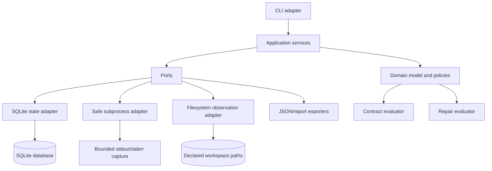
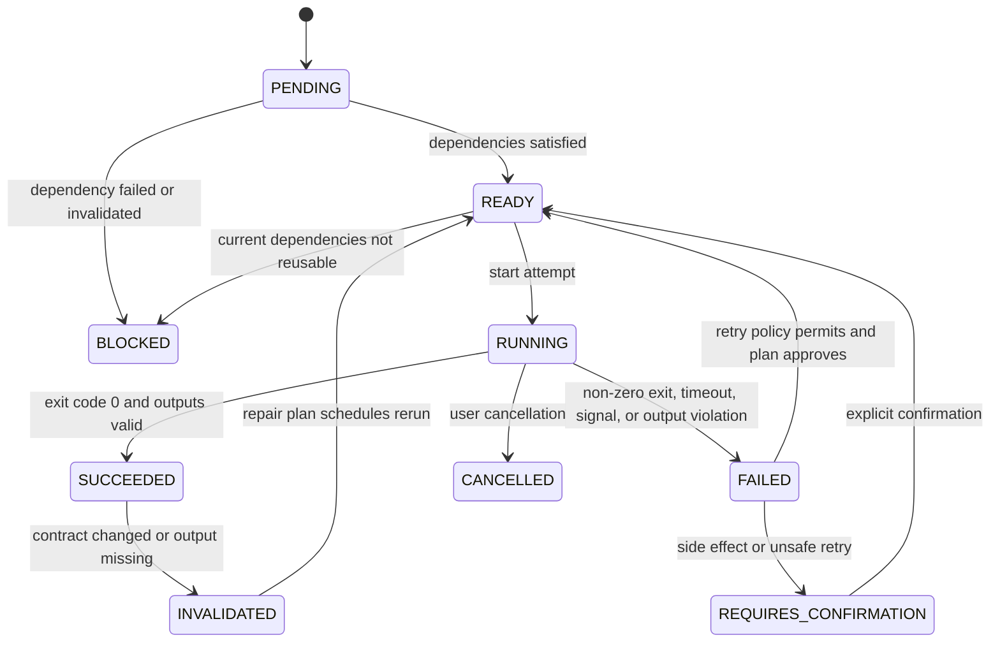
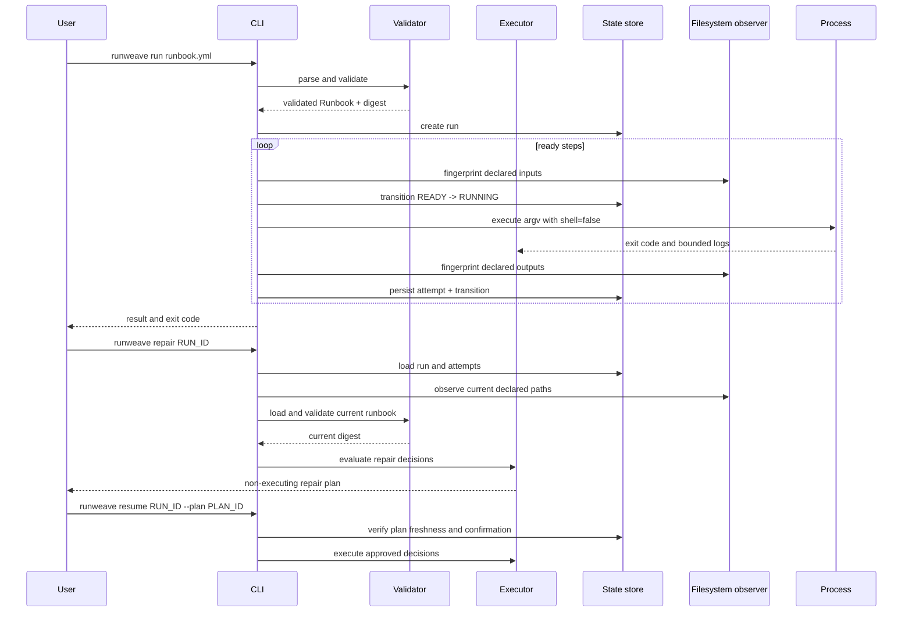

# RunWeave Architecture

## Architectural style

RunWeave uses a layered, dependency-inverted architecture. The domain layer owns runbook semantics, step contracts, state transitions, retry classification, and repair decisions. The application layer coordinates use cases. Ports define interfaces for state storage, command execution, filesystem observation, clock, and export. Adapters implement the CLI, YAML/JSON parsing, SQLite persistence, subprocess execution, filesystem hashing, and report rendering.

The architecture intentionally avoids a distributed workflow engine. The MVP is a single-process local application with transactional persistence. The design still treats state transitions, attempts, contracts, and adapters as explicit boundaries so a future remote backend or worker executor can be added without rewriting business rules.

## Module map

| Module | Responsibility | Must not know about |
|---|---|---|
| `domain.runbook` | Immutable runbook, step, policy, and schema concepts | SQLite, Click, PyYAML implementation details |
| `domain.state` | State enum, transitions, attempts, and invariants | CLI formatting, subprocess APIs |
| `domain.contracts` | Digests, path observations, input/output contract evaluation | Storage schema, terminal output |
| `domain.recovery` | Retry classification, invalidation, repair-plan decisions | SQLite queries, YAML parsing |
| `application.validate` | Parse and validate a runbook at the boundary | Terminal rendering details |
| `application.plan` | Build deterministic topological execution plans | Concrete subprocess and database classes |
| `application.execute` | Coordinate run lifecycle, step attempts, persistence, and events | CLI argument parsing |
| `application.repair` | Load a run, observe current state, create a repair plan, and enforce plan identity | Direct SQL and filesystem implementation |
| `ports.state_store` | Repository contract for runs, attempts, transitions, and plans | SQLite SQL syntax |
| `ports.command_runner` | Contract for bounded, non-shell command execution | `subprocess.Popen` details |
| `ports.observer` | Contract for safe declared-path fingerprints | `pathlib` traversal implementation |
| `ports.exporter` | Contract for canonical evidence and reports | Specific output format internals |
| `adapters.yaml_runbook` | YAML parsing and boundary validation | Domain decision logic |
| `adapters.sqlite_store` | SQLite schema, migrations, transactions, and queries | CLI and policy decisions |
| `adapters.local_executor` | `shell=False` subprocess execution, timeouts, signals, and logs | Retry policy decisions |
| `adapters.filesystem` | Path resolution, streaming hashes, symlink checks, and redaction | Run lifecycle orchestration |
| `adapters.json_export` | Canonical JSON and human report rendering | State transition decisions |
| `cli` | User input, exit codes, and human/JSON presentation | SQL, subprocess, hashing algorithms |

## Domain entities

### Runbook

A `Runbook` is an immutable validated definition with `schema_version`, `name`, `root`, and ordered `StepDefinition` values. The canonical serialization is normalized before hashing. Unknown fields are rejected in the MVP to prevent silently ignored safety policies.

### StepDefinition

A step has a stable ID, argument vector, dependencies, working directory, declared inputs, declared outputs, environment allowlist, timeout, retry policy, side-effect class, and evidence policy. The command vector is never represented as a single interpolated shell string.

### StepContract

A `StepContract` contains the canonical command digest, policy digest, input fingerprint, output expectation, and optional provider metadata. It is the basis for deciding whether an earlier success can be reused.

### RunAttempt

A `RunAttempt` records attempt identity, runbook digest, step contract digest, start/end timestamps, status, exit code, termination reason, bounded log references, observed inputs/outputs, and redaction metadata. Attempt records are immutable after completion except for a crash-recovery marker that is itself recorded as a transition.

### RepairPlan

A `RepairPlan` contains a plan ID, source run ID, current runbook digest, observed workspace digest for declared paths, and an ordered decision for every step. A decision includes status, reason code, explanation, dependencies, and whether explicit confirmation is required. Resume accepts a plan only if its identity and freshness checks pass.

## State machine

A stale `RUNNING` attempt discovered at startup is not silently marked successful. It becomes `FAILED` with termination reason `PROCESS_INTERRUPTED` and enters repair evaluation. The engine never infers success from the presence of an output alone when the contract requires a completed attempt record.

## Data model

The SQLite database uses a schema version table and append-only transition records. The core tables are:

| Table | Key fields | Purpose |
|---|---|---|
| `schema_meta` | `schema_version` | Migration and compatibility control |
| `runs` | `run_id`, `runbook_digest`, `status`, timestamps | Current run summary |
| `steps` | `run_id`, `step_id`, `status`, `contract_digest` | Current step projection |
| `attempts` | `attempt_id`, `run_id`, `step_id`, `attempt_no`, `status` | Immutable execution attempts |
| `transitions` | `transition_id`, `run_id`, `step_id`, `from_state`, `to_state`, timestamp | Auditable state history |
| `fingerprints` | `attempt_id`, `kind`, `path`, `digest`, metadata | Declared input/output observations |
| `repair_plans` | `plan_id`, `run_id`, `source_digest`, `status` | Plan identity and freshness |
| `repair_decisions` | `plan_id`, `step_id`, `decision`, `reason_code` | Explainable recovery decisions |

Transactions cover each state transition and its associated attempt metadata. The store exposes domain-shaped methods such as `create_run`, `record_attempt_started`, `record_attempt_finished`, `append_transition`, `save_repair_plan`, and `load_repair_plan`; application services do not issue SQL directly.

## Execution flow

## Error flow

Every operational error maps to a stable error code and a remediation-oriented message. The CLI uses exit code 0 for success, 2 for invalid user input or runbook validation, 3 for blocked or unsafe recovery, 4 for command execution failure, and 5 for internal/storage failure. JSON output carries the same code, message, context, run ID, step ID, and suggested action.

| Error class | Example code | User action |
|---|---|---|
| Runbook invalid | `RUNBOOK_VALIDATION_ERROR` | Fix the named schema, path, or dependency issue and validate again. |
| Dependency cycle | `DEPENDENCY_CYCLE` | Remove the reported cycle from the runbook graph. |
| Unsafe path | `PATH_OUTSIDE_ROOT` | Keep declared paths inside the configured workspace root. |
| Execution failure | `STEP_FAILED` | Inspect the attempt logs and run `repair` before deciding to resume. |
| Stale run | `STALE_RUNNING_ATTEMPT` | Review the interrupted step and generate a new repair plan. |
| Plan stale | `REPAIR_PLAN_STALE` | Generate a new repair plan because the runbook or inputs changed. |
| Confirmation required | `SIDE_EFFECT_CONFIRMATION_REQUIRED` | Explicitly confirm the named side-effecting step or change its policy. |
| State conflict | `STATE_CONFLICT` | Do not overwrite another active process; inspect the run state. |

## Security model

RunWeave assumes runbooks, environment variables, paths, command arguments, and subprocess output may contain malicious or sensitive data. It executes argument vectors with `shell=False`, resolves paths against a configured root, rejects symlink inputs and outputs by default, bounds stdout/stderr capture, allows only explicitly named environment variables, redacts names matching secret patterns, and never persists environment values by default. It does not claim to sandbox arbitrary commands; users should run untrusted workloads inside an appropriate container or VM.

Side-effect classes are explicit: `PURE`, `WORKSPACE_WRITE`, `NETWORK_READ`, `EXTERNAL_WRITE`, and `DESTRUCTIVE`. The engine may automatically retry only `PURE` and selected `WORKSPACE_WRITE` steps. `EXTERNAL_WRITE` and `DESTRUCTIVE` steps require a declared policy and confirmation on recovery. A step’s policy is part of its contract, so changing the classification invalidates prior reuse decisions.

## Performance strategy

The first implementation prioritizes correctness over parallel throughput. File hashing is streamed in 1 MiB chunks, declared paths are the only paths observed, and SQLite indexes run/step IDs and statuses. Planning is deterministic and can expose parallel-ready groups, but execution remains sequential in the MVP to keep state transitions and failure semantics easy to audit. Benchmarks will measure validation, planning, fingerprinting, and state persistence independently.

## Extension strategy

The stable extension points are `CommandRunner`, `WorkspaceObserver`, `StateStore`, `EvidenceExporter`, and `PolicyProvider`. Future adapters can provide remote state, OpenLineage events, DVC-aware fingerprints, container execution, or CI-specific annotations. Extensions must consume domain contracts rather than bypassing state transitions.

## Architecture decisions

| Decision | Rationale |
|---|---|
| Python 3.11+ | Fits the user’s strongest language and supports typed dataclasses, `sqlite3`, modern `enum`, and a strong test ecosystem without runtime services. |
| SQLite first | Durable local persistence with transactions and no server dependency; easy to inspect and back up. |
| YAML input, canonical JSON internally | YAML is approachable for runbooks; canonical JSON makes hashing, exports, and compatibility explicit. |
| `argparse` CLI | Standard-library entry point keeps the MVP dependency-light and easy to install; the interface can later be wrapped by another frontend. |
| `subprocess` with `shell=False` | Makes command boundaries explicit and avoids shell interpolation as a default. |
| Ports and adapters | Keeps recovery logic testable without running processes or writing SQLite in unit tests. |
| Sequential MVP execution | Reduces concurrency ambiguity; parallel planning can be measured and added after the correctness model is proven. |
